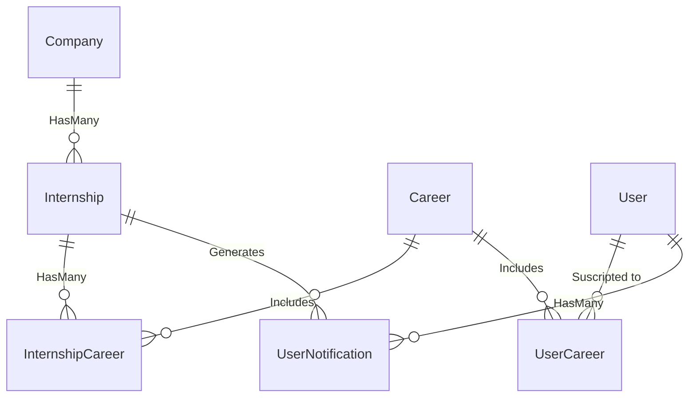

## Entities

- **Company** — Companies that offers the internships.
- **Internship** — Published and available internship.
- **Career** — Current asked careers of the internships (Sistemas, Civil, etc.).
- **InternshipCareer** — N:M relation between internships and careers.
- **User** — Registered vía Clerk.
- **UserCareer** — Careers of intertest of the registered users.
- **UserNotification** — Log of sent alerts to the users with 'seen' flag.
